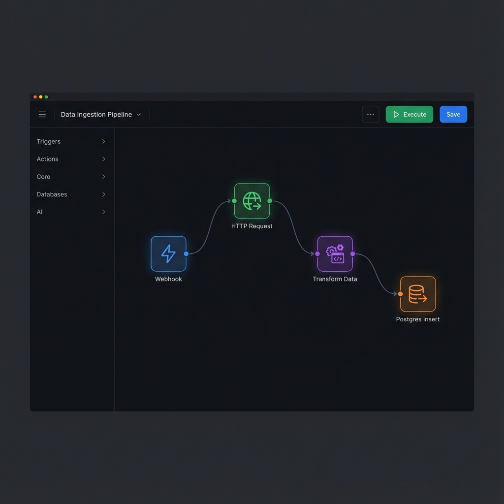

# Citadel Agent

[](https://github.com/fajar/citadel-agent/actions/workflows/ci.yml)
[](LICENSE)
[](https://goreportcard.com/report/github.com/fajar/citadel-agent)

Citadel Agent is a powerful workflow automation platform that allows you to create, manage, and execute complex workflows using a visual interface. It supports hundreds of different node types for various operations including HTTP requests, database operations, AI processing, and more.



## 🚀 Features

- **Visual Workflow Builder**: Drag-and-drop interface to create workflows
- **150+ Node Types**: Including HTTP, Database, AI, Utility, Logic, and Flow nodes
- **Self-Hosted**: Deploy on your own infrastructure
- **AI Integration**: Supports both local models and API-based AI services
- **Real-time Execution**: Monitor and debug workflows as they run
- **Scalable Architecture**: Built with Temporal for reliable execution

## 🛠️ Tech Stack

- **Backend**: Go, Temporal, Fiber, PostgreSQL, Redis
- **Frontend**: React, ReactFlow, Zustand, TypeScript
- **AI**: Local LLMs (Llama), OpenAI API, Embeddings
- **Infrastructure**: Docker, Docker Compose, Prometheus, Grafana

## 📋 Prerequisites

- Go 1.21+
- Node.js 18+
- Docker and Docker Compose
- Git

## 🚀 Quick Start

Get Citadel Agent up and running in minutes with a single command:

```bash
git clone https://github.com/fajar/citadel-agent.git
cd citadel-agent
make up
```

This will start all services (Frontend, Backend, Temporal, Postgres, Redis) using Docker Compose.

Once started, access the application at:
- **Frontend**: http://localhost:5173
- **Backend API**: http://localhost:8080
- **Temporal UI**: http://localhost:8081

### Alternative: Manual Setup

If you prefer to run services individually or need more control:

1. **Setup Project**: `./scripts/setup-project.sh`
2. **Start Backend**: `make run-backend`
3. **Start Frontend**: `make dev-frontend`

## 💡 Examples

Check out the `examples/` directory for ready-to-use workflows:

- **[HTTP Data Processing](examples/http-processing-workflow.json)**: Fetch data from an API, process it, and save to a database.
- **[Scheduled Task](examples/scheduled-task.json)**: Run a recurring task every hour.
- **[API Integration](examples/api-integration.json)**: Connect multiple APIs together.

## 🏗️ Project Structure

```
backend/
├── internal/
│   ├── workflow/core/     # Core workflow engine and interfaces
│   ├── nodes/             # Node implementations (http, database, utility, etc.)
│   └── api/               # API handlers
├── pkg/                   # Shared utilities
├── tests/                 # Test files
└── main.go                # Main application entry point

frontend/
├── src/
│   ├── components/        # React components
│   ├── stores/            # Zustand stores
│   └── api/               # API client
├── package.json
└── vite.config.ts

configs/                    # Configuration files
├── app.yaml               # Application configuration
├── db/                    # Database schema and migrations
└── nodes/                 # Node configuration

scripts/                    # Utility scripts
└── setup-project.sh       # Setup script
```

## 🧪 Testing

Run backend tests:

```bash
make test-backend
```

Run all tests:

```bash
make test
```

## 🛠️ Development

### Adding a new node type

1. Create a new file in the appropriate category under `backend/internal/nodes/`
2. Implement the `NodeInstance` interface
3. Register the node in the `registerNodes` function in `main.go`

### Running in development mode

```bash
# Auto-reload backend on changes
make dev-backend

# Run frontend in development mode
make dev-frontend
```

## 🚢 Deployment

For production deployment, check out the `production` branch for containerized deployment configurations.

## 📚 Documentation

- [API Documentation](./API_DOCS.md)
- [Architecture Guide](./ARCHITECTURE.md)
- [Node Development Guide](./docs/guides/node-development.md)
- [AI Integration Guide](./docs/guides/ai-integration.md)

## 🤝 Contributing

Contributions are welcome! Please read our [Contributing Guide](./CONTRIBUTING.md) for details on our code of conduct and the process for submitting pull requests.

## 📄 License

This project is licensed under the Apache License 2.0 - see the [LICENSE](./LICENSE) file for details.

## 🆘 Support

If you have any questions or issues, please open an issue in the GitHub repository.