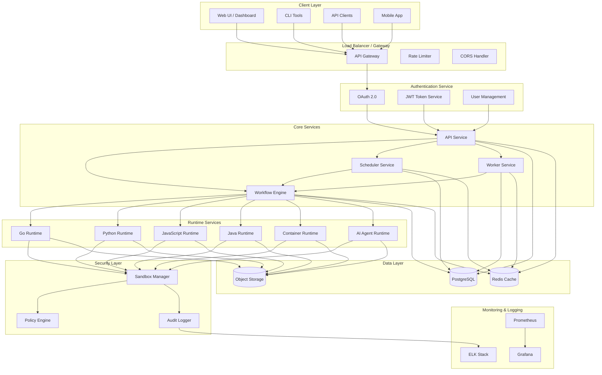
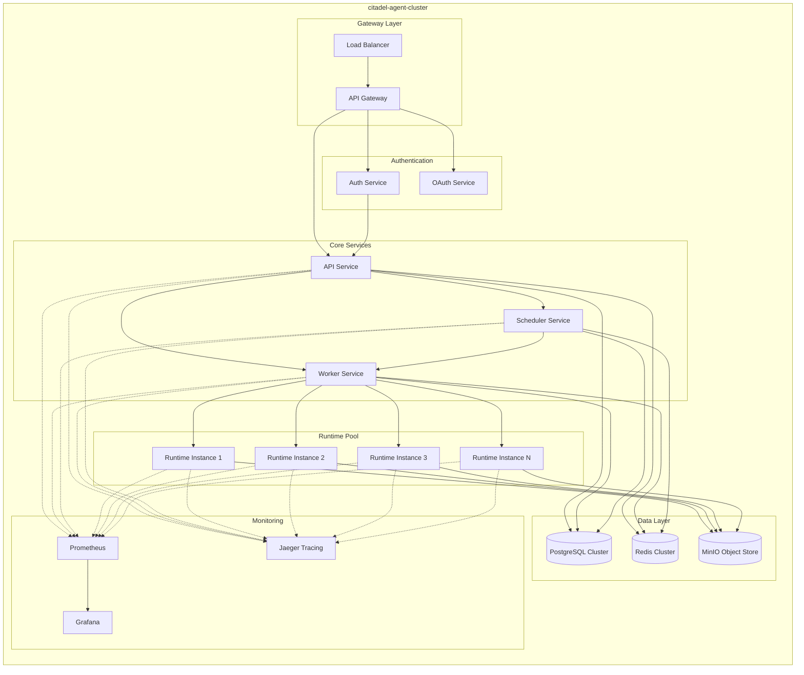
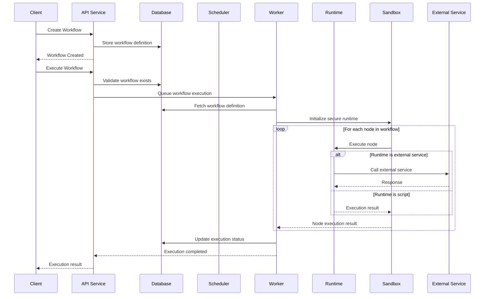
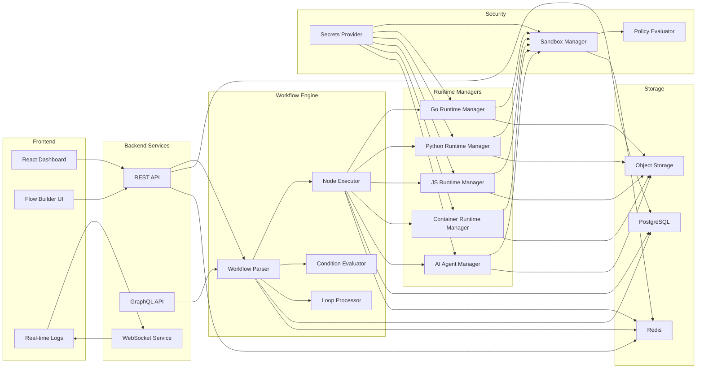
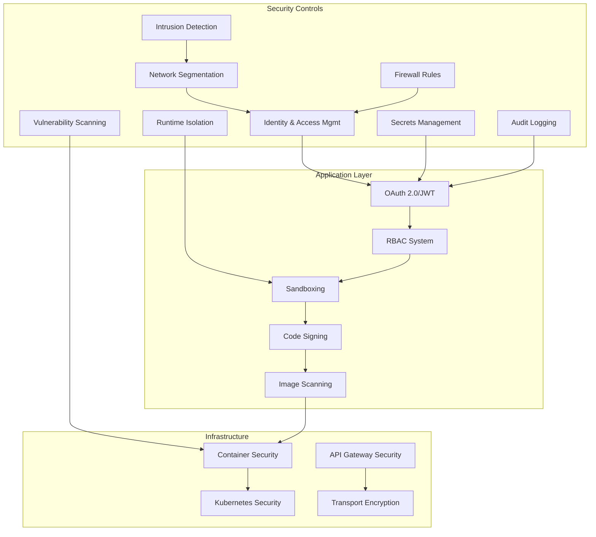
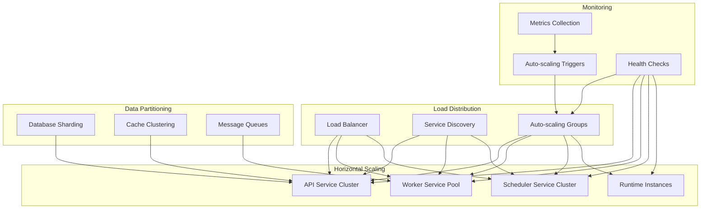
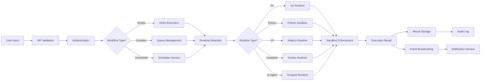
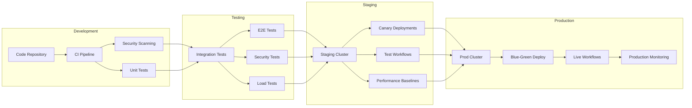
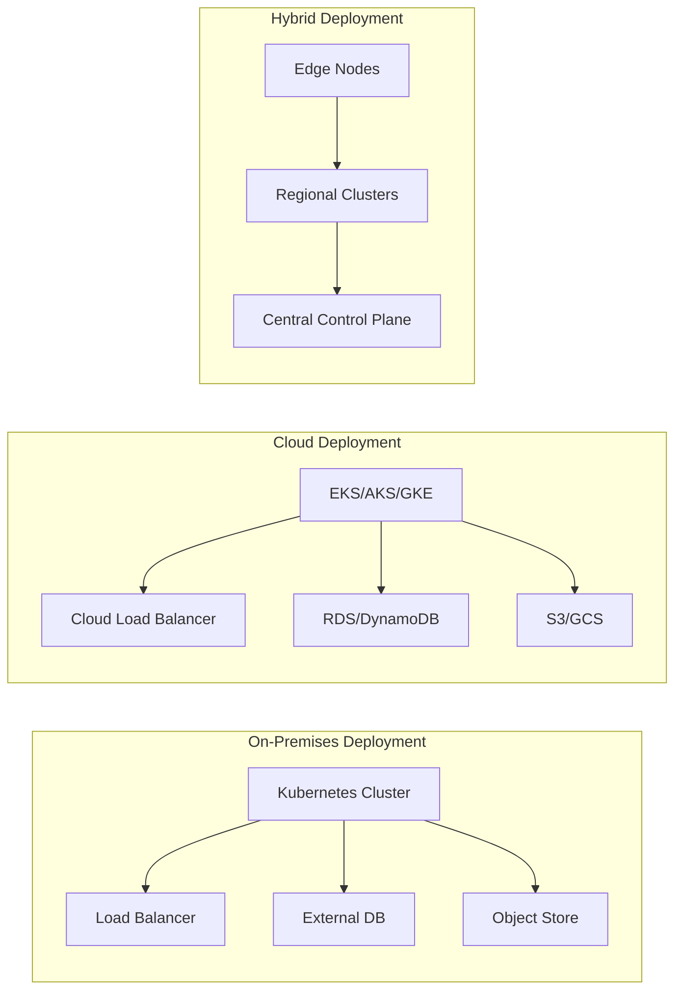

# Citadel Agent - Arsitektur Lengkap

## Overview
Citadel Agent adalah platform otomasi workflow modern dengan kemampuan AI agent, multi-language runtime, dan sandboxing keamanan lanjutan. Arsitektur dirancang untuk skalabilitas, keamanan, dan modularitas.

## High-Level Architecture

## Microservices Architecture

## Workflow Execution Flow

## Component Interaction Diagram

## Security Architecture

## Scalability Architecture

## Data Flow Architecture

## DevOps Architecture

## Deployment Architecture

